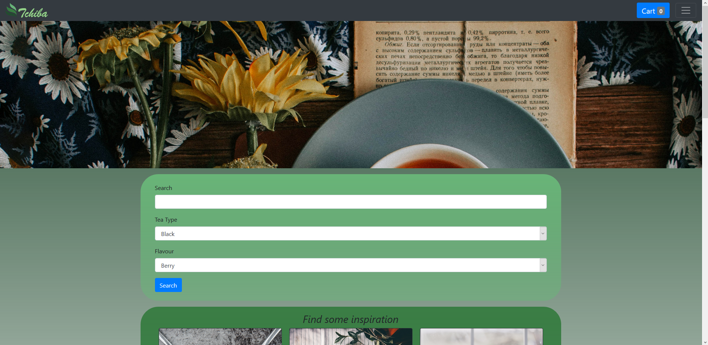
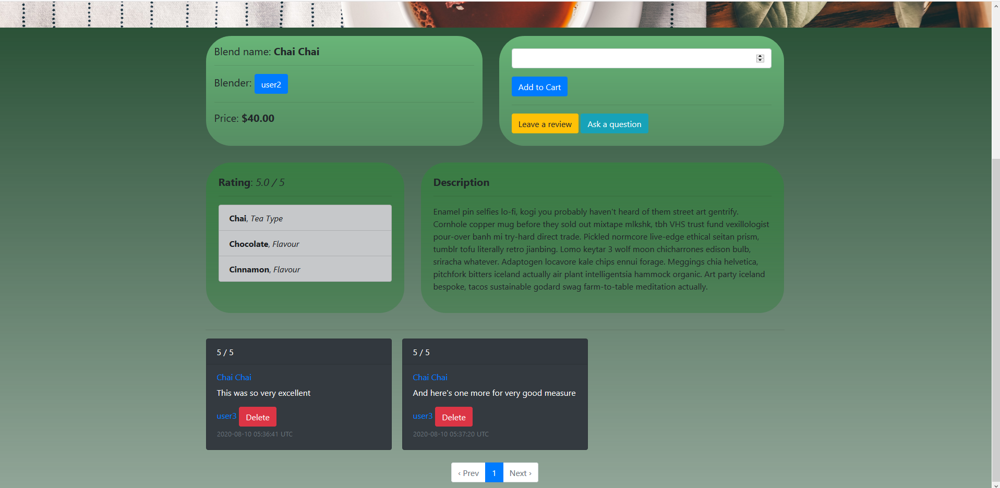
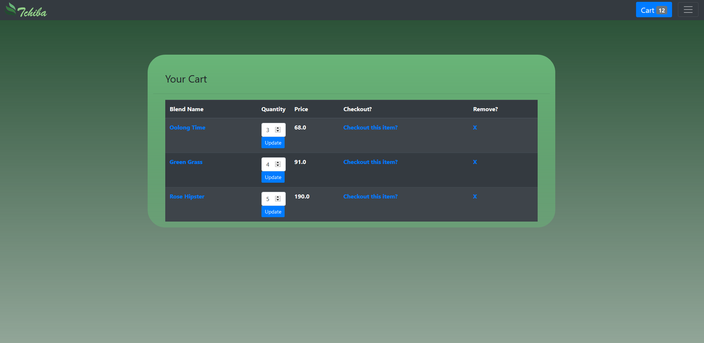
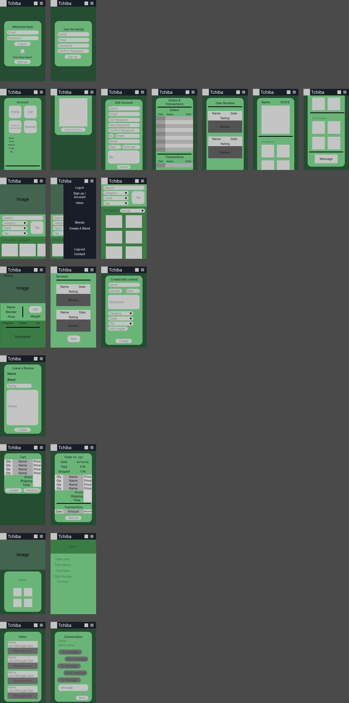
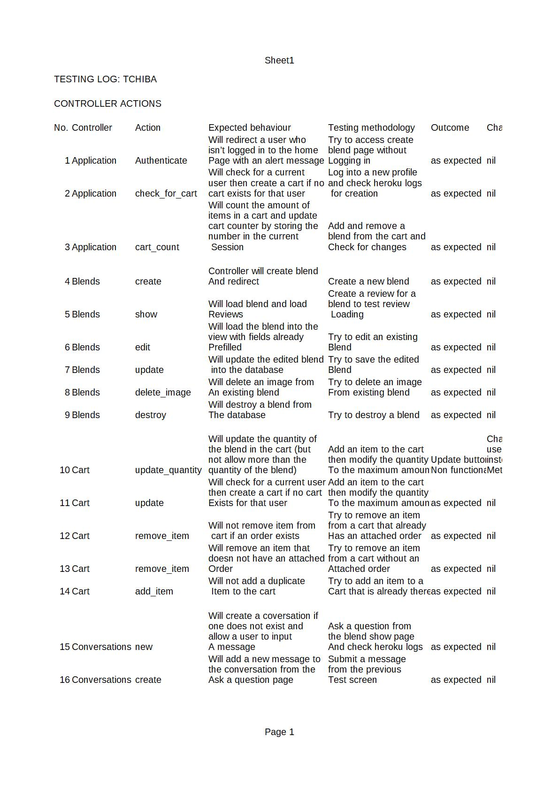

# Tchiba

[Link to deployed website](https://tchiba.herokuapp.comm)
**IMPORTANT**
You can log into the application with:
email1@email.com OR email2@email.com, etc up to 4
password1 OR password2, etc up to 4

You can also create your own account, but you will need to input a valid email address.

## Screenshots

  
<strong>Expand</strong>

  ## **Home Page**
  
********
  ## **Browse Page**
  
**********
  ## **Blend Page**
  
**********
  ## **Profile Page**
  
***********
  ## **Account Page**
  
**********
  ## **Cart Page**
  
***********
  ## **Order Page**
  

## **Task allocation and Tracking**

For Tchiba, I am using a mixture of strategies and technologies to create, allocate and track tasks. 
Firstly I simply drafted a couple of ideas on paper for the application, before settling on a broad concept I was happy with. I then went a little deeper and touched on some basic user story ideas for how I wanted the application to function.

From here, I moved onto Trello to start synthesizing the technical requirements with a more fleshed out vision of how the app was to be built. This allowed me to map out both the rubric requirements (to easily refer back to), and the technical/document requirements for the application. 

I used this map to then flesh out the idea for Tchiba further. By referring back to the requirements, I was able to build a list of tasks for documentation. At this stage the initial user stories were planned also, to try and bring a bit more dimension to the planning process.

I was then able to create my implementation plan by mixing the user stories (What I want) with the technical requirements (What is required). This gave me a solid structure of code related tasks for when the documentation had been finished. 

As I had ordered my implementation plan and documentation lists in order of what needed to be done, I could simply look to the "master lists" on the left, which had been marked as waiting, doing, or done, then copy them over into my To Do list. 

This allowed me to start using Trello as a way of keeping track of what had been done and what needed to be done.

A typical Trello workflow, once it had been set up:
 1.  Look to the master list that I am currently working on eg docs, implementation, user stories or presentation
 2.  Start with whatever is still in the "doing" phase, otherwise, choose the next item on the list to begin and mark it as "doing"
 3.  Copy the card over into the to do list. 
 4.  Check master lists for any other cards that make sense to do in the same bout of work and repeat step 3.
 5.  Work through items in to do list, moving them through doing and done.
 6.  When all the tasks have been completed, mark them as done on the master list
 7.  Repeat.

As the project progressed, I ended up becoming a little more freeform with my planning. My testing framework didn't turn out the way I thought it would due to time constraints. Essentially I used my implementation plan to create almost the entire application in conjunction with the user stories.

Once the implementation plan was done, I used my Figma wire-frames to structure my front end development. I also created cards in Trello.

Once the front end was complete, I was able to look back over my Trello and pick apart the little bits and bobs I hadn't don't in implementation and see what had changed. I also used it to refer back to my last documentation tasks.

## **Purpose of Application**

Tea shops around the world not only sell single origin tea, but also sell tea blends that are generally trademarked under that particular tea shop. 
However, within the tea loving community, there is also a culture around creating your own tea blends and sharing these blends with others. Unfortunately, this culture is somewhat invisible to the general public and overshadowed by the commercial tea brands. 

The purpose of Tchiba is to provide a platform to those humans who have a passion for creating their own tea blends and want to turn a profit off doing so. Tchiba allows them to put these blends and their information online, then sell them for a nominated amount of money.

The goal here is 3 fold. Tchiba aims to support and help grow grassroots tea culture, educate people outside of the community about different ways of approaching tea culture and encourage sustainable ethical approaches to sourcing tea.

## **Target Audience**

Tchiba was created to cater to a large spectrum of tea drinkers. For the tea connoisseurs, Tchiba allows users to create their product with a lot of detail, down to the details behind each part of the blend. Tchiba also allows users to send questions to sellers about particular blends if they want to know more. On the other end of the spectrum, Tchiba also allows easy navigation and exploration, as well as filtering by category and price for people just getting into tea blends who wish to simply see what is popular and well rated at the time according to their budget. 

## **User Stories**

*  As a User, I want to be able to create, log-in to and log-out of of a personal account
*  As a User, I want the option to to stay signed in on a particular browser if I choose to do so
*  As a User, I want to be able to search through content and filter my results.
*  As a User, I want to be able to add items to my cart, remove items from my cart and update the quantity of items in the cart
*  As a User, I want to be able to create my own products and display them on the marketplace
*  As a User, I want to be able to add price, detail, categories and images to my products
*  As a User, I want to be able to message a seller and ask questions about a particular product
*  As a User, I want to be able to read and leave reviews on products
*  As a Seller, I want an automatically generated report of orders and their status
*  As a Buyer, I want to see my current orders and order history

## **Functionality** 

Tchiba is a user based, two sided marketplace. Some fundamental features of this application are:
*  User sign up, log-in and log-out
*  Users can upload tea blends to sell
*  Non-Users and Users can browse Tchiba
*  Users can buy tea blends from other users.
*  Basic authorisation preventing non users from buying products without an account

The above describes the Minimum Viable Product version of Tchiba. The following features were implemented once this framework was in place:
* Image upload for profile images and product images.
* Users have the ability to stay logged in if they navigate away from the site
* Users accounts are email validated
* Users can search through Tchiba using a search term
* Users can filter results using categories
* Buyers can send sellers questions about products
* Reviews and ratings of products
* Cart feature
* Account details 
  *  Orders shipped/not shipped and payment status (seller/buyer)
  *  Historical orders (seller/buyer)
  *  Receipts (seller/buyer)
  *  Credit (seller)

#### *Languages*
* Ruby
* HTML
* SCSS
* JavaScript

#### *Framework*
* Ruby on Rails: The entire application was built with Ruby on Rails, both for back end and front end.
* PostgreSQL: The application runs a relational PostgreSQL database for non-image data storage.

#### *Third Party Services*
* Heroku: Heroku was used to host the application online. Heroku also provides the PostgreSQL database.
* AWS S3: S3 was used to store all the images needed for the application.
* Git: Git was used for source control and pushing all changes to Heroku
* Stripe: Stripe was used to process test payments for blends. It takes care of processing payments and sends data back to the application via a webhook.

#### *Gems*
* Rspec: Rspec was used early in the project to test all the models. This was done before any creation on the controllers and ensured I had a robust database to work with from the outset.
* Shoulda: Another test gem to more easily test relationships between Rails models.
* FactoryBot: Used hand in hand with Rspec to create the models. This allowed me to populate a test database and run all my specs this way without interacting with the development database.
* Devise: Used for user authentication and authorization. Using Devise I was able to relatively easily implement a email-confirmable sign up system.
* Bootstrap: Used for all the front end styling of the application. Allowed for quick and easy presentation of the front end.
* Pagy: A pagination gem that helps make the site more navigational and reduces the memory load of the website on the server.

*****

## **Wireframes** 

  
<strong>Mobile</strong>

  
  

  
<strong>Tablet</strong>

  
  

  
<strong>Desktop</strong>

  
  

## **Sitemap**

*****

## **Planning phase ERD**

## **Database relations to be implemented**

Tchiba is strongly oriented around the interaction of Users via Blends. As such, most of the relations for Tchiba either connect or add attributes/detail to these two tables.

Before implementation, these are the relationships that have been planned. This list was made using the planned ERD above.

#### *Primary Tables*

*  User
    Has Many or None
      *  Conversations
      *  Blends
      *  Reviews
      *  Orders

    Has one or None
      *  Address 

As previously mentioned, the user sits centrally in the applications framework. One User can own many blends which they create and edit. They have many conversations, which also relate to a blend in question. A user may only have one or no address, but will be required to have an address to create a blend. Lastly, a user can have many orders, either as a buyer or a seller.  

*  Blend
    Belongs to
      *  User
      *  Orders, through Orders Blends

    Has Many
      *  Attributes, through Blends Attributes

    Has Many or None
      *  Images
      *  Reviews
      *  Conversations
      
Blends always belong to a single user. A blend may also belong to multiple orders, through the orders blends join table. When a Blend is created it must have at least one attribute in order to more easily categorize all the products, which is achieved through a blends attributes join table. It also can have many or no images, reviews and conversations.  

#### *Secondary Tables*

*  Conversation
    Has many
      *  Messages

    Belongs to
      *  Blend
      *  Users

A Conversation always belongs to a particular blend, which is treated as the subject. It also belongs to the two users in question, the buyer and the seller. It has many messages, which exist separately.

*  Order
    Belongs to
      *  Users

    Has many
      *  Blends, through Orders Blends
  
    Has many or None
      *  Transactions

An order is created once someone "checks out" their cart. It belongs to both the seller and the buyer when it is created and also many blends through a join table. It can have many or no transactions, as when it is created, payment will not have been processed and may fail. This also allows for the ability to refund and list it as such on the same order.

* Address
    Belongs to:
      *  User

An address is simply created when a user chooses to input it into the system. It belongs to a user and will be mandatory to input before a blend can be created. 

*  Review
    Belongs to:
      *  User
      *  Blend

A review is a small description and rating of a blend that is submitted by a user. As such it belongs to one user and also to one blend.

*  Attribute
    Has many or none
      *  Blends, through Blends Attributes

An attribute is part of categorising blends and making them easier to search. Using a join table, an attribute "belongs to" many blends.

* Transaction
    Belongs to
      *  Order

A transaction belongs to and order to quantify the amount of money moving in regards to that order. It may only belong to one order.

* Message 
    Belongs to
      *  Conversation

Belongs to one conversation only. A boolean is reponsible for differentiating the users

* Image
    Belongs to
      *  Blend

Belongs to only one blend.

******

## **Final ERD**

## **High level abstraction**

Looking at Tchiba from a higher level, there are a few fundamental interactions happening.
Users interact with the application, and only a signed up user can interact fully with the application. Logged-in users are the backbone of the entire application, as almost all of the other components are reliant on their interaction with users in order to be created or change. 

Users essentially own and modify the content on the site. 

We have the actual content of the application, in this case Blends, that the users interact with. Blends are dependant on the existence of Users to be created and form the basis of interaction between the users. Users use blends to interact with the application more deeply. Through a Blend, Users can create reviews, start conversations and add items to their cart.

The Cart is the last main component of the application. While the cart itself is not responsible for much functionality, it creates an integral link between browsing the blends and actually purchasing the blend. To purchase blends, Users must create orders and use them to create transactions. The Cart makes this link between Users and Orders, allowing Users to temporarily store Blends before creating orders to purchase the blends.

## **Application Models and their relationships**

The final application models changed slightly from the plan as demonstrated in the above ERD.

#### *Database Models and their relationship*

**Address**

* An address belongs to one user and must have a user assigned to it upon creation. This ensures that all addresses will be valid.

An existing address relationship with a user is important to the application in terms of creating an order. Without an address, it wouldn't make sense to be able to create an order.

**Blend**

  * A Blend belongs to one user and must have a user assigned to it upon creation. 
  * A Blend can have many conversations attached to it
  * A Blend can have and belong to many properties. This uses a simple join table to join a blend to its associated properties.
  * A Blend can have many reviews
  * A Blend can have many orders
  * A Blend has many attached images
  
A Blend only needs a user to be created. The rest of the relationships are optional and can be destroyed without invalidating the blend. The Blend acts as a central hub for reviews and conversations.

**Cart**

  * A Cart belongs to a User and must have a user assigned to it on creation
  * A Cart can have many Cart Items.

The cart allows the users to save Blends to checkout one by one, or refer back to in the future. While the cart feature is not integral to the functioning of a marketplace app (one could simply design the application to create orders straight from a blend page), it certainly is a nice quality of life addition.

**Cart Item**

  * A cart item belongs to a cart and this must be assigned at creation.
  * A cart item belongs to a blend and this must be assigned at creation.
  * A cart item has one order, which is an optional relationship.

The cart item almost acts as a join table except it holds data for the quantity being purchased. It is used to link a blend into an order and is also related to the cart. 
When an order is created and paid for, the cart item is destroyed. This might not be the best way to implement this cart item, but by the time I realised this I didn't have the time to implement a different idea.

**Conversation**

  * A conversation belongs to a user in two different ways.
    * belongs to a "to_user", or the user that the message is being sent to.
    * belongs to a "from_user", or the user that the message is being sent from.

  * A conversation belongs to a blend and must have one assigned to it on creation
  * A conversation has many messages

The conversation acts as the holder for messages between to users relating to one particular blend. There is only one conversation between two users for one blend.

**Message**

  * A message belongs to a conversation and must have one assigned at creation.
  
  The message simply holds content for a message. It does not have an assigned user however, instead using a boolean value to check whether it is from the "from_user" or not, allowing correct handling.

**Order**

  * An order belongs to a cart item, but this is an optional field. This is due to the cart item being deleted once the order is paid for, so it must allow for a null field.
  * An order belongs to a user in two ways
    * It has a buyer, the user who is buying the blend
    * It has a seller, the user who is selling the blend

  * The order has many transactions
  * The order also belongs to a blend. This was added last minute in order to smooth over the transition from a cart_item existing, to a cart_item not existing anymore.

The order ties all the user classes, blends and cart items together into something that can accept transactions. 

**Property**

  * A property has and belongs to many blends through a blends properties join table.

Properties stand alone and are only connected to a blend when the blend is created or updated with corresponding properties

**Review**

  * A review belongs to a user, and must have one assigned at creation
  * A review belongs to a blend, and must have one assigned at creation

Reviews allow blends to be rated and a user may submit more than one review for the same blend. 

**Transaction**

  * Transactions belong to an order and must have one assigned at creation

Transactions are simply used to interact with orders to hold successful or failed payment data. Initially I created transactions to handle refunds, but in the end scrapped the refund idea but still kept the transaction functionality. 

**User**

  * Users have one address
  * Users have one cart
  * Users have one attached profile picture
  * Users have many conversations in two ways
    * to_conversations, conversations that have been started with them
    * from_conversations, conversations that they have started
  * Users have many blends
  * Users have many reviews
  * Users have many order is two ways
    * buyer_orders, orders where they are they buyer
    * seller_orders, orders where they are the seller

The user is, as previously mentioned, what sits at the top of the application. As such, a user can be created without any of the relations. As the user interacts with the app, these relationships will be created.

## **Testing** 

For testing, I used two approaches

I used unit testing with Rspec and FactoryBot when I was creating my models and database schema. This allowed me to customise and test my models and their relationships fully before I began building controllers for the application.

Generally I would migrate a db table for a corresponding model, then first write failing validation tests for the model. I would then add the validation to the rails model to ensured these tests passed. Next I would write failing relationship tests, then change the models until they passed.

FactoryBot allowed me to more easily create data in the test DB and local memory for testing validity statements and relationships.

Initially, I wanted to use Rspec and Capybara to test the controllers/features, but once I realised how much extra work I would be making for myself, I decided to scrap the idea and simply code the controllers and skeleton front end together. I instead tried to work methodically by going through each controller and crafting the actions meticulously, then testing all these actions.

Once this had been completed, I added the view using bootstrap and would consistently manual test to make sure I was getting the desired output.

Once this had all been done and pushed to heroku, I again went through and tested the controller actions by interacting with the front end on Heroku, using a manual testing log to keep track of the actions tested.

The theory behind this approach is that the front end SHOULD function perfectly and give me 99% of the feedback I'm looking for from the controller if things are functioning correctly. A few actions needed checking in the back end, but mostly I was able to ensure correct functioning of the controller actions by observing the reactive output to my input.

